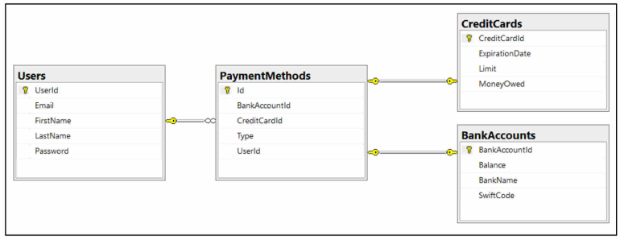

# Bill Payment Management System

## Introduction
The Bill Payments Application is a user-friendly and convenient tool designed to simplify the process of managing and paying bills. With this application, users can effortlessly track their bills, receive reminders for due dates, and make secure payments directly from their devices. Whether you need to pay your utility bills, credit card bills, or any other recurring payments, this application has got you covered.

## Features
1. Bill Management: Easily add, edit, and delete bills within the application. Organize bills by categories or due dates for a clear overview of your expenses.

2. Reminder Notifications: Receive timely reminders for upcoming bill due dates, ensuring that you never miss a payment again. Customizable notification settings allow you to set reminders according to your preferences.

3. Payment Integration: Seamlessly link your bank accounts, credit cards, or payment gateways to the application for quick and secure bill payments. Enjoy the convenience of paying your bills within the app without the need to switch between different platforms.

4. Recurring Payments: Set up recurring payments for bills that occur regularly, eliminating the need for manual input each time. Define the frequency and duration of recurring payments to automate your bill payment process.

5. Payment History: Access a comprehensive payment history that displays all your past bill payments, including transaction details, dates, and payment methods. Stay informed about your financial records and track your payment patterns over time.

6. Data Security: The Bill Payments Application prioritizes the security of your personal and financial information. It employs robust encryption techniques to safeguard sensitive data, ensuring that your payment details are protected from unauthorized access.

7. User-Friendly Interface: Enjoy a clean and intuitive user interface designed to enhance your bill payment experience. The application is easy to navigate, providing a seamless user experience for users of all levels of technical expertise.

## Contributin
We welcome contributions from the community to improve the Bill Payments Application. To contribute, follow these steps:

1. Fork the repository and create a new branch for your contribution.

2. Make the necessary changes and additions to the codebase.

3. Write tests for your changes to ensure code stability.

4. Submit a pull request, clearly describing the changes you've made and their purpose.

## Download file
[Click here to download the PDF file](https://github.com/TkachYevhenii2303/Bill_Payment_Management_System/blob/main/Advanced-Relations.pdf)

